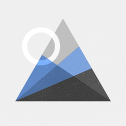

<div align="center">



# Imagura

**Fast async image viewer built with Python and raylib.**

[](pyproject.toml)
[](pyproject.toml)
[](https://www.raylib.com/)
[](#installation)

[Русский](readme.md) · English

</div>

---

## About

Imagura is a lightweight image viewer focused on speed and smoothness. Decoding and
loading run on background threads, heavy full-size textures and animation frames are
cached, and the UI (gallery, zoom, overlays) stays responsive even on large files. It
runs both in a transparent fullscreen mode and in a window.

## Features

- **Async loading** — CPU decode and GPU upload run on background threads; the UI never
  stalls on heavy images.
- **Formats** — PNG, JPG/JPEG, BMP, GIF (animated), TGA, QOI, WebP (animated).
- **Sortable gallery** — by name, modified date, created date, size, type, and date
  taken (EXIF); ascending/descending, preserving the open file after re-sorting.
- **Zoom** — wheel and keys, anchored to the cursor, toggling 1:1 / fit / custom modes.
- **Caches** — a FIFO VRAM cache for full-size textures and a RAM cache for decoded
  animation frames; reopening a cached item shows no loading indicator.
- **EXIF HUD** — an overlay with image metadata.
- **Unicode** — correct file names in Cyrillic and other scripts.
- **Settings** — a settings modal; values are saved to user JSON
  (`%APPDATA%\Imagura\settings.json`), not into code.
- **Conveniences** — toolbar, context menu, send-to-recycle-bin delete, clipboard
  support, localization (i18n).
- **Transparent background** — fullscreen mode with a transparent framebuffer.

## Installation

### Prebuilt installer (recommended)

Download `Imagura-2.1.0-setup.exe` from the
[**Releases**](https://github.com/Barmagloth/Imagura/releases) page and run it. The
installer adds a Start Menu shortcut, optionally a desktop one, registers file
associations for supported formats (via "Open with", without hijacking your current
defaults), and uninstalls cleanly.

### Run from source

Requires Python ≥ 3.10 (Windows).

```bat
git clone https://github.com/Barmagloth/Imagura.git
cd Imagura
py -m pip install -e .[exif]
python -B imagura2.py
```

Open a specific file or folder:

```bat
python -B imagura2.py "D:\Photos\picture.png"
python -B imagura2.py "D:\Photos"
```

## Controls

| Action | Keys / mouse |
| --- | --- |
| Next / previous image | `→` / `←`, `D` / `A`, click screen edge |
| Zoom | mouse wheel, `↑` / `↓`, `W` / `S` |
| Toggle zoom mode (1:1 / fit / custom) | `Z` |
| Pan | drag with left button |
| Context menu | right button |
| Window / fullscreen | `F` |
| Toggle HUD | `I` |
| Toggle filename | `N` |
| Cycle background | `V` |
| Delete image (to recycle bin) | `Delete` |
| Quit | `Esc` |

## Building on Windows

See [`packaging/windows/README.md`](packaging/windows/README.md) for details. In short:

```bat
py -m pip install -e .[windows-build,exif]
:: 1) build the one-dir app (PyInstaller)
python -B tools\build_windows_exe.py --clean
:: 2) build the installer (needs Inno Setup 6/7, ISCC)
iscc packaging\windows\imagura.iss
```

Output: `dist\Imagura\Imagura.exe` and `dist\installer\Imagura-2.1.0-setup.exe`.

## Documentation

- [`imagura/ARCHITECTURE.md`](imagura/ARCHITECTURE.md) — module boundaries and architecture.
- [`imagura/HANDOFF.md`](imagura/HANDOFF.md) — state, how to run, tests, backlog.
- [`docs/QA_CHECKLIST.md`](docs/QA_CHECKLIST.md) — manual QA checklist.
- [`docs/profiling.md`](docs/profiling.md) — profiling and performance notes.

## Tests

```bat
python -B tools\run_smoke_tests.py --timeout 10
```

## Author

**Barmagloth** — [github.com/Barmagloth](https://github.com/Barmagloth)
